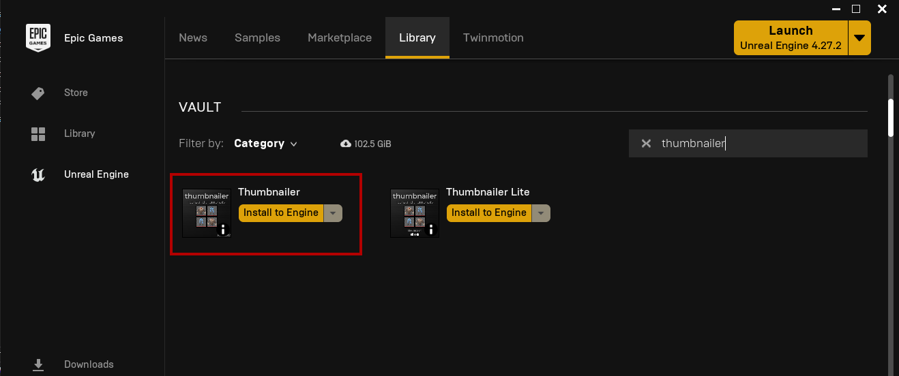
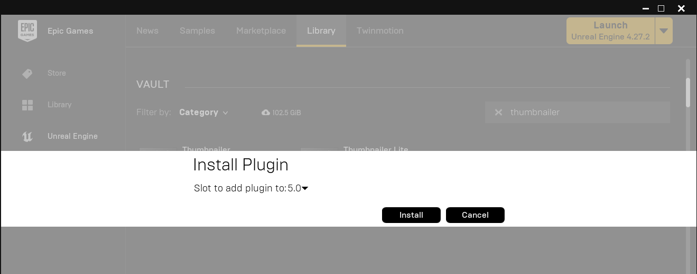
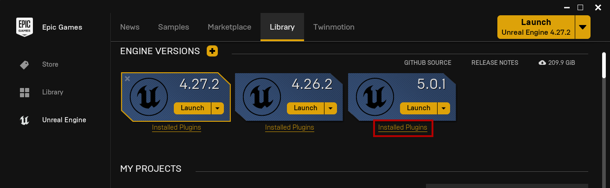
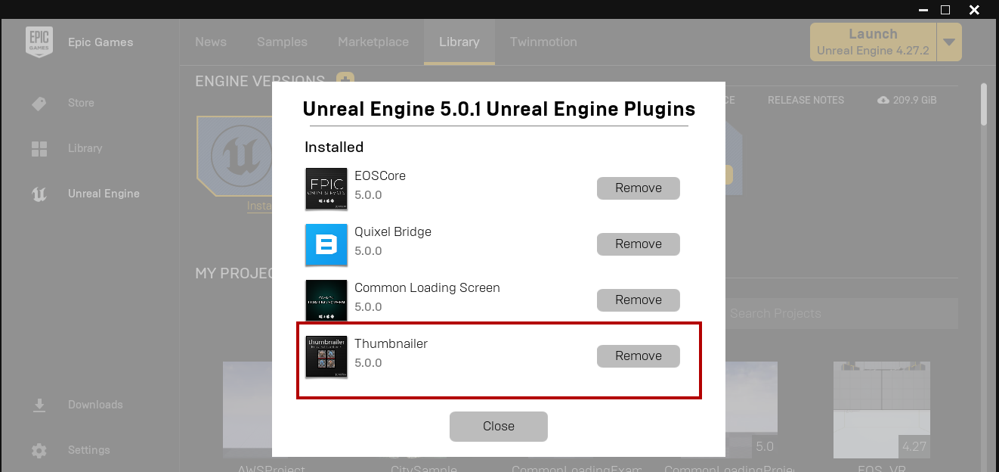
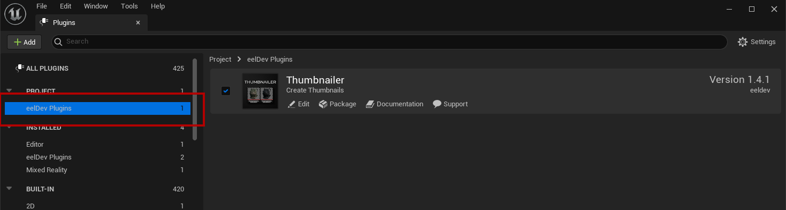
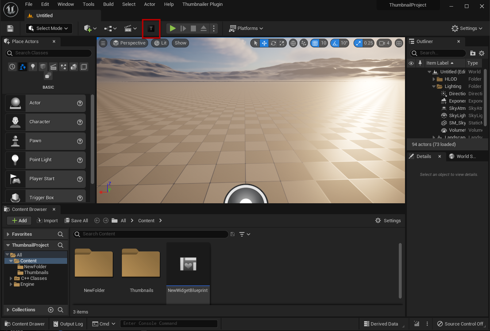
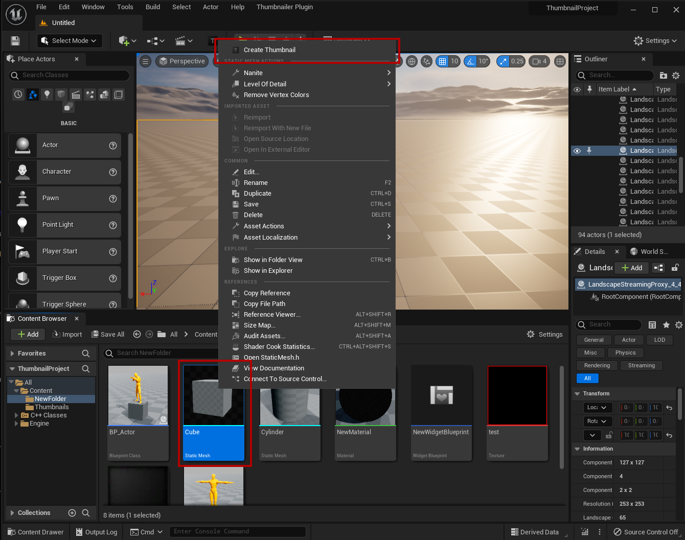
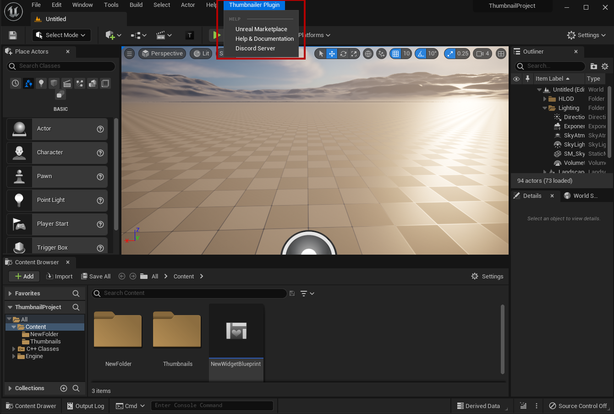
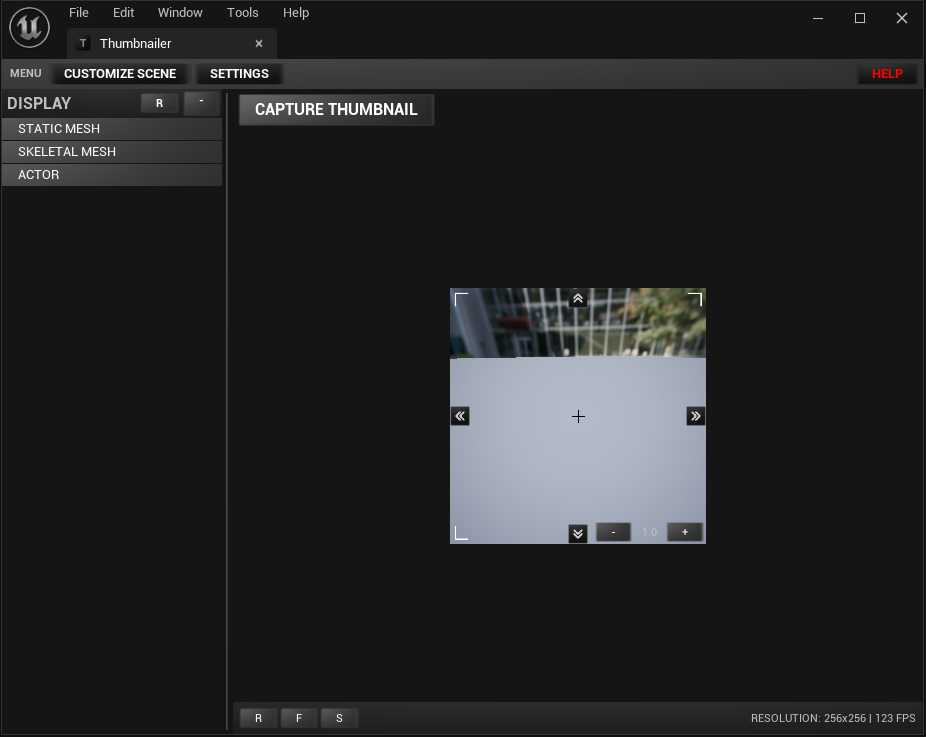

# Installing the plugin
- You can only install the plugin using the Epic Launcher

## Locate the plugin
- Search for **Thumbnailer**

## Select Engine Version
- Select the engine version to install

## Verify plugin installation
- Verify that the plugin was installed

## Enable Plugin
- Make sure the plugin is enabled in your project

## Opening the Thumbnailer Window
### Toolbar
- Locate the Thumbnailer button on the top toolbar

### Right Click
- You can also open the thumbnailer window by right clicking any supported type (ie. Skeletal Mesh or a Static Mesh) and select **Create Thumbnail**

### Thumbnailer Menu

## The Thumbnailer Window
- This is what the current version of the Thumbnailer Window looks like

