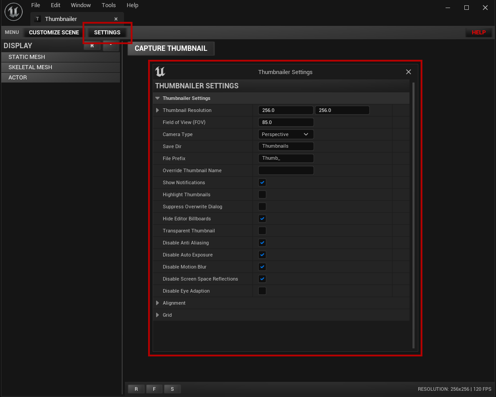
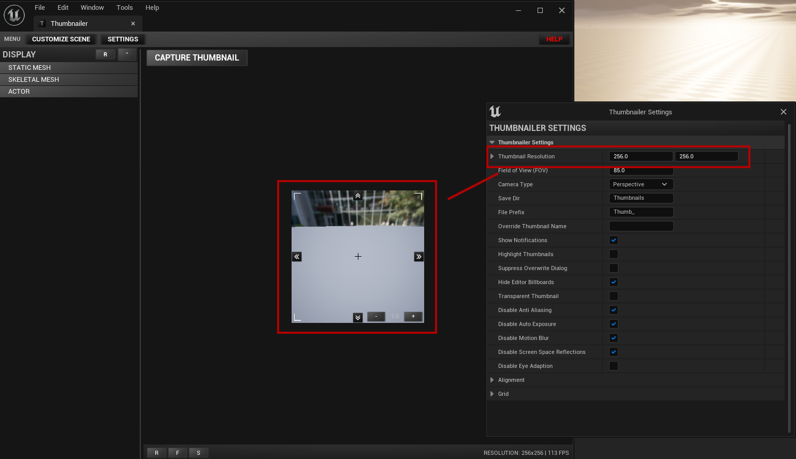
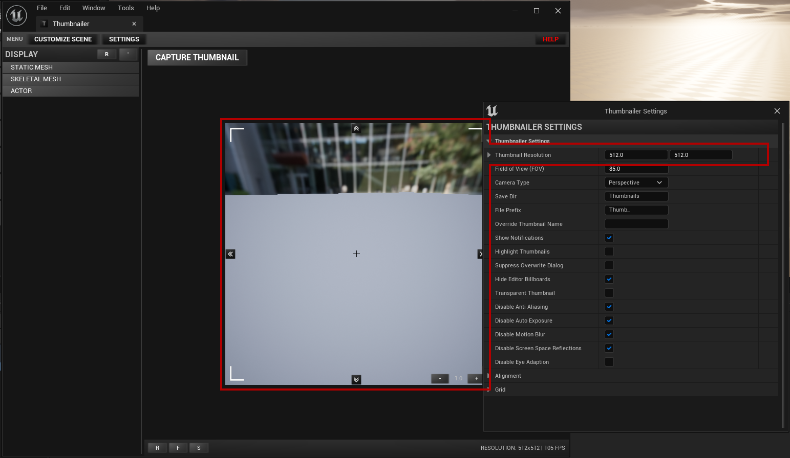
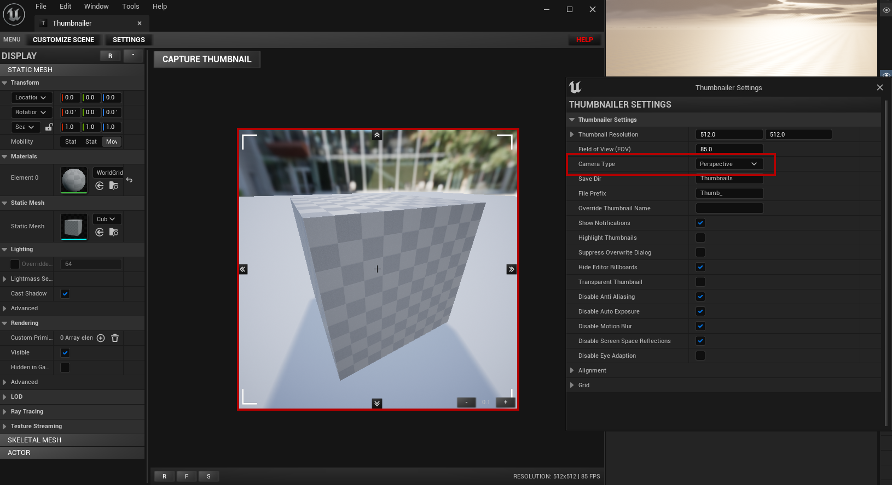
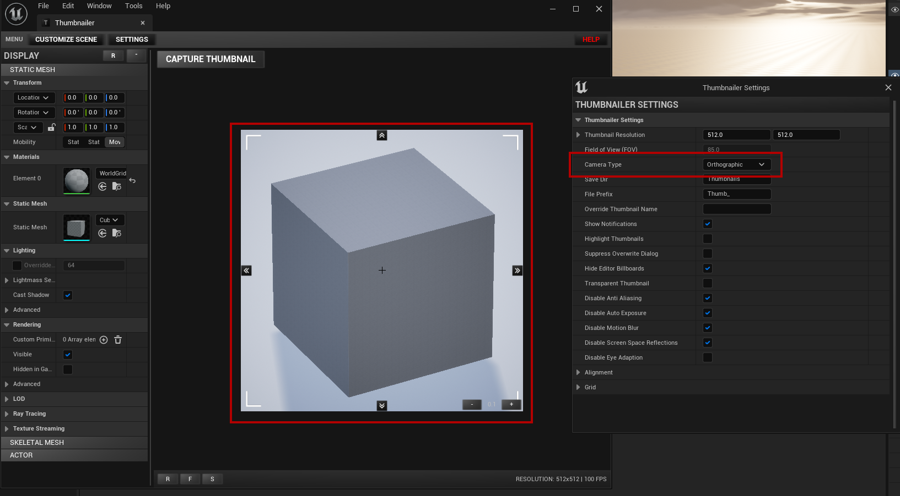
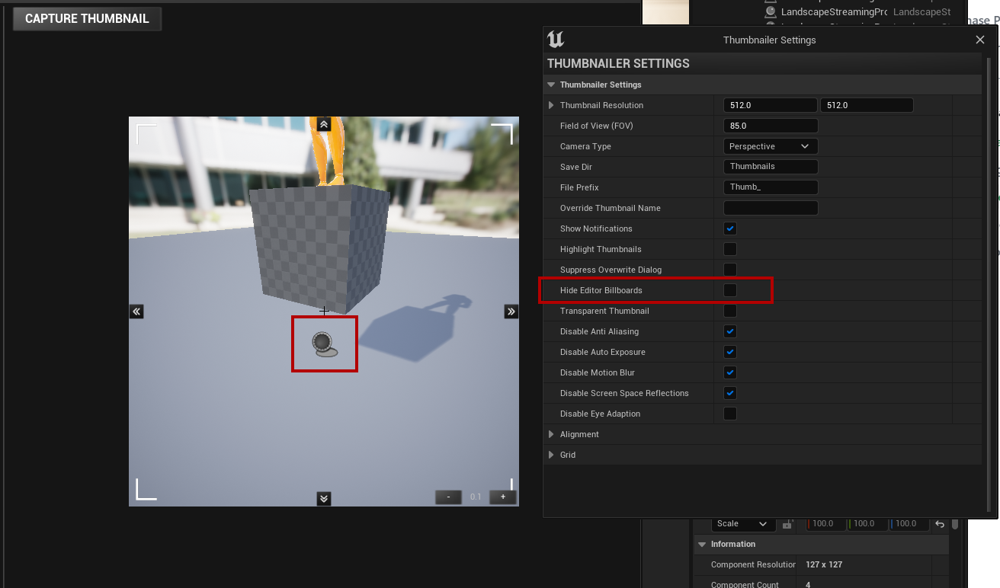
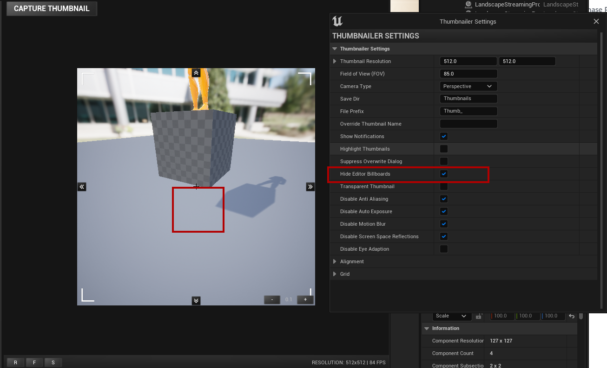

# Plugin Settings
- The Thumbnailer Plugin has a lot of settings that can be customized to your needs

## Settings
### **Thumbnail Resolution**
- This will change the output resolution of the thumbnail, it will also affect the preview window to give you a sense of scale what the final thumbnail will look like

### **Field of View**
- Change the Field of View (aka FOV) of the viewport camera, smaller number will make the object more 2d-like

### **Camera Type**
- Switch between Perspective and Orthographic Camera

### **Save Dir**
- Set the output directory for the generated/captured thumbnails

### **File Prefix**
- File prefix to append to the thumbnail filename, ie Thumb_MyActor

### **Override Thumbnail Name**
- This allows you to override the default naming scheme of the plugin, by default the thumbnails name will be the same as the mesh being captured

### **Show Notifications**
- Show or Hide popup notifications when a thumbnail was saved/created

### **Highlight Thumbnails**
- When creating a new thumbnail focus the content browser on the newly created thumbnail

### **Suppress Overwrite Dialog**
- Always overwrite old files

### **Hide Editor Billboards**
- Hide billboards when capturing actors that has a billboard attached

### **Transparent Thumbnails**
- **[See this Documentation](./transparent-thumbnails.md)**