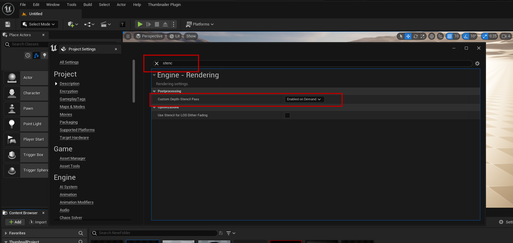
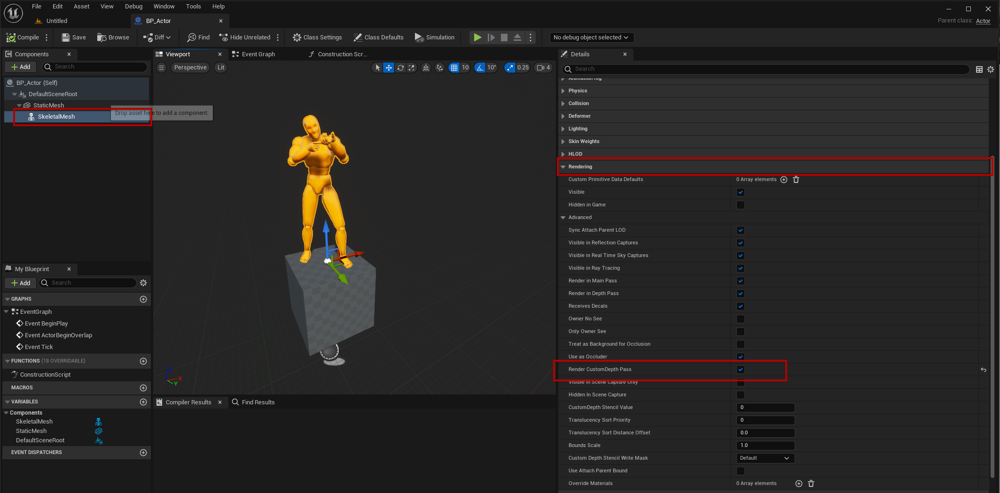
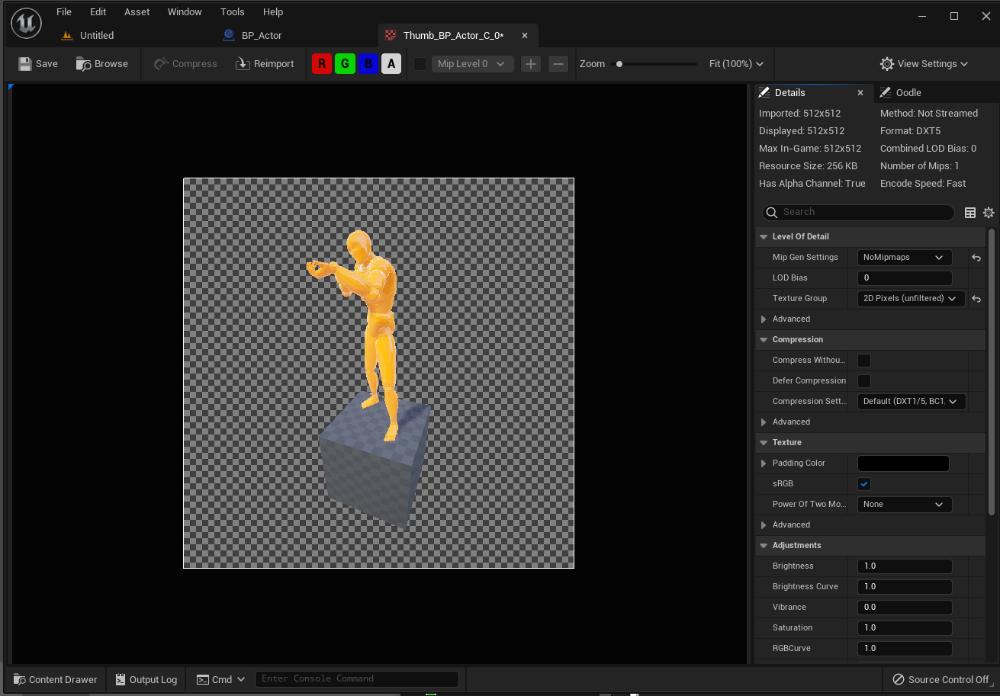

# Transparent Actors
- To use Transparent Thumbnails we must enable **Custom Depth-Stencil Pass** in Project Settings, it must be set to **Enable on Demand**

## Setting up the Actor
- To capture an **Actor Thumbnail** that has a Transparent background we need to make a few changes to the **Actor Blueprint**, every rendered component must have **Render CustomDepth Pass** enabled otherwise it will not be rendered when capturing the transparet thumbnail

## The Result
