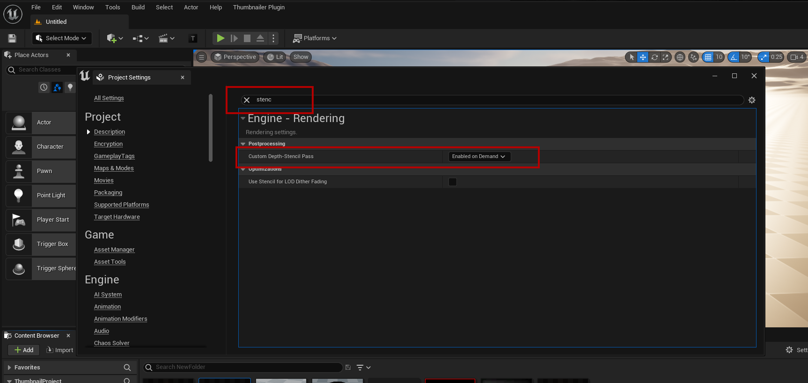

# Transparent Thumbnails
- To use Transparent Thumbnails we must enable **Custom Depth-Stencil Pass** in Project Settings, it must be set to **Enable on Demand**

# Check Transparent Thumbnail Option

# The Result

